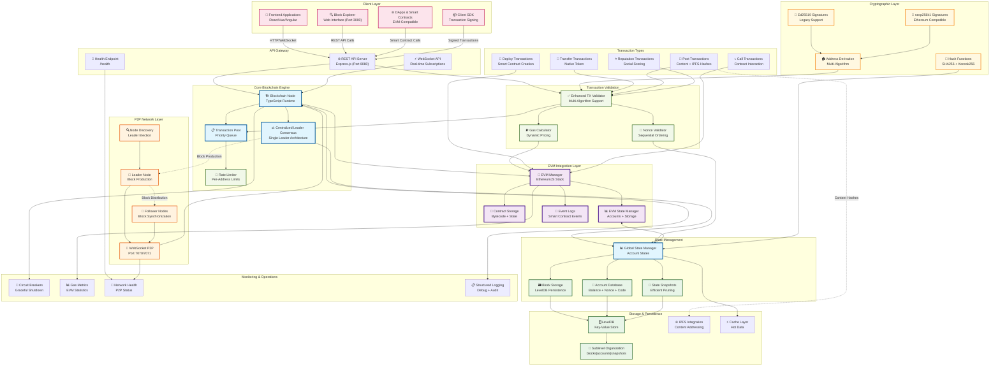

```mermaid
graph TD
    subgraph "Client Layer"
        Frontend["📱 Frontend Applications<br/>React/Vue/Angular"]
        Explorer["🔍 Block Explorer<br/>Web Interface (Port 3000)"]
        DApps["🌐 DApps & Smart Contracts<br/>EVM-Compatible"]
        ClientSDK["📦 Client SDK<br/>Transaction Signing"]
    end

    subgraph "API Gateway"
        APIServer["🌐 REST API Server<br/>Express.js (Port 8080)"]
        WebSocketAPI["⚡ WebSocket API<br/>Real-time Subscriptions"]
        HealthEndpoint["💚 Health Endpoint<br/>/health"]
    end

    subgraph "Core Blockchain Engine"
        Node["🏗️ Blockchain Node<br/>TypeScript Runtime"]
        Consensus["⚖️ Centralized Leader Consensus<br/>Single Leader Architecture"]
        Mempool["📋 Transaction Pool<br/>Priority Queue"]
        RateLimiter["🚦 Rate Limiter<br/>Per-Address Limits"]
    end

    subgraph "Transaction Validation"
        TxValidator["✅ Enhanced TX Validator<br/>Multi-Algorithm Support"]
        GasCalculator["⛽ Gas Calculator<br/>Dynamic Pricing"]
        NonceValidator["🔢 Nonce Validator<br/>Sequential Ordering"]
    end

    subgraph "EVM Integration Layer"
        EVMManager["🤖 EVM Manager<br/>EthereumJS Stack"]
        ContractStorage["💾 Contract Storage<br/>Bytecode + State"]
        EVMState["📊 EVM State Manager<br/>Accounts + Storage"]
        EventLogs["📝 Event Logs<br/>Smart Contract Events"]
    end

    subgraph "Cryptographic Layer"
        Ed25519Crypto["🔐 Ed25519 Signatures<br/>Legacy Support"]
        Secp256k1Crypto["🔐 secp256k1 Signatures<br/>Ethereum Compatible"]
        AddressDerivation["🏠 Address Derivation<br/>Multi-Algorithm"]
        HashFunctions["🔗 Hash Functions<br/>SHA256 + Keccak256"]
    end

    subgraph "State Management"
        StateManager["📊 Global State Manager<br/>Account States"]
        BlockStorage["🗃️ Block Storage<br/>LevelDB Persistence"]
        StateSnapshots["📸 State Snapshots<br/>Efficient Pruning"]
        AccountDB["👤 Account Database<br/>Balance + Nonce + Code"]
    end

    subgraph "P2P Network Layer"
        LeaderNode["👑 Leader Node<br/>Block Production"]
        FollowerNodes["👥 Follower Nodes<br/>Block Synchronization"]
        WebSocketP2P["🔗 WebSocket P2P<br/>Port 7070/7071"]
        NodeDiscovery["🔍 Node Discovery<br/>Leader Election"]
    end

    subgraph "Transaction Types"
        TransferTx["💸 Transfer Transactions<br/>Native Token"]
        PostTx["📝 Post Transactions<br/>Content + IPFS Hashes"]
        ReputationTx["⭐ Reputation Transactions<br/>Social Scoring"]
        DeployTx["🚀 Deploy Transactions<br/>Smart Contract Creation"]
        CallTx["📞 Call Transactions<br/>Contract Interaction"]
    end

    subgraph "Storage & Persistence"
        LevelDB["🗄️ LevelDB<br/>Key-Value Store"]
        Sublevels["📂 Sublevel Organization<br/>blocks|accounts|snapshots"]
        IPFS["🌐 IPFS Integration<br/>Content Addressing"]
        CacheLayer["⚡ Cache Layer<br/>Hot Data"]
    end

    subgraph "Monitoring & Operations"
        ErrorHandling["🚨 Circuit Breakers<br/>Graceful Shutdown"]
        GasMetrics["📊 Gas Metrics<br/>EVM Statistics"]
        NetworkHealth["💚 Network Health<br/>P2P Status"]
        LoggingSystem["📋 Structured Logging<br/>Debug + Audit"]
    end

    %% Client Layer Connections
    Frontend -->|HTTP/WebSocket| APIServer
    Explorer -->|REST API Calls| APIServer
    DApps -->|Smart Contract Calls| APIServer
    ClientSDK -->|Signed Transactions| APIServer

    %% API Gateway Routing
    APIServer --> Node
    WebSocketAPI --> Node
    HealthEndpoint --> NetworkHealth
    APIServer --> TxValidator

    %% Core Blockchain Flow
    Node --> Consensus
    Node --> Mempool
    Mempool --> RateLimiter
    TxValidator --> Mempool
    Consensus --> StateManager

    %% Transaction Validation Pipeline
    TxValidator --> GasCalculator
    TxValidator --> NonceValidator
    GasCalculator --> EVMManager
    NonceValidator --> StateManager

    %% EVM Integration Flow
    Node --> EVMManager
    EVMManager --> ContractStorage
    EVMManager --> EVMState
    EVMManager --> EventLogs
    EVMState <--> StateManager

    %% Cryptographic Operations
    Ed25519Crypto --> AddressDerivation
    Secp256k1Crypto --> AddressDerivation
    AddressDerivation --> TxValidator
    HashFunctions --> StateManager

    %% State Management Flow
    StateManager --> BlockStorage
    StateManager --> StateSnapshots
    StateManager --> AccountDB
    BlockStorage --> LevelDB
    AccountDB --> LevelDB

    %% Transaction Type Processing
    TransferTx --> TxValidator
    PostTx --> TxValidator
    ReputationTx --> TxValidator
    DeployTx --> EVMManager
    CallTx --> EVMManager

    %% P2P Network Operations
    LeaderNode --> WebSocketP2P
    FollowerNodes --> WebSocketP2P
    WebSocketP2P --> Node
    NodeDiscovery --> LeaderNode
    Consensus -.->|Block Production| LeaderNode
    LeaderNode -.->|Block Distribution| FollowerNodes

    %% Storage Layer
    LevelDB --> Sublevels
    StateSnapshots --> LevelDB
    PostTx -.->|Content Hashes| IPFS
    StateManager --> CacheLayer

    %% Monitoring Integration
    Node --> ErrorHandling
    EVMManager --> GasMetrics
    WebSocketP2P --> NetworkHealth
    Node --> LoggingSystem

    %% Enhanced Styling
    classDef coreNode fill:#e1f5fe,stroke:#01579b,stroke-width:3px
    classDef evmNode fill:#f3e5f5,stroke:#4a148c,stroke-width:3px
    classDef cryptoNode fill:#fff8e1,stroke:#f57c00,stroke-width:2px
    classDef storageNode fill:#e8f5e8,stroke:#1b5e20,stroke-width:2px
    classDef networkNode fill:#fff3e0,stroke:#e65100,stroke-width:2px
    classDef clientNode fill:#fce4ec,stroke:#c2185b,stroke-width:2px
    classDef validationNode fill:#f1f8e9,stroke:#33691e,stroke-width:2px
    
    class Node,Consensus,StateManager,Mempool coreNode
    class EVMManager,ContractStorage,EVMState,EventLogs evmNode
    class Ed25519Crypto,Secp256k1Crypto,AddressDerivation,HashFunctions cryptoNode
    class BlockStorage,LevelDB,StateSnapshots,AccountDB,Sublevels storageNode
    class LeaderNode,FollowerNodes,WebSocketP2P,NodeDiscovery networkNode
    class Frontend,Explorer,DApps,ClientSDK clientNode
    class TxValidator,GasCalculator,NonceValidator,RateLimiter validationNode
```
