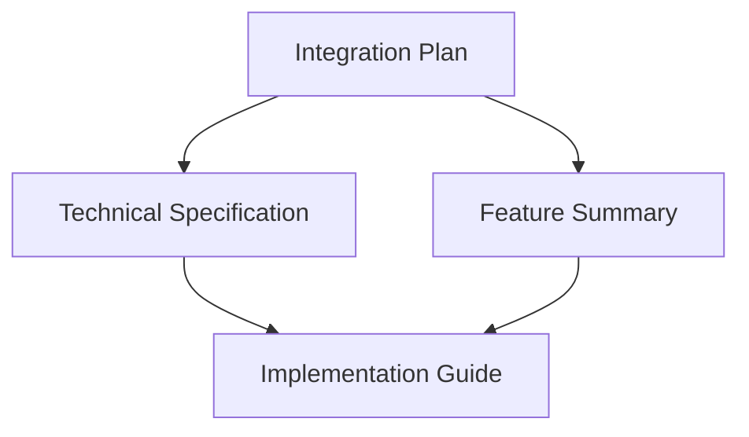

# Native Token Documentation Overview

## Overview

This document provides an overview of all the documentation files created for integrating a native FORGE token into the mini blockchain. Each file serves a specific purpose in planning, designing, implementing, and understanding the native token integration.

## Documentation Files

### 1. Native Token Integration Plan
**File**: [NATIVE_TOKEN_INTEGRATION_PLAN.md](file:///c:/Users/dubci/Desktop/mini_chain/NATIVE_TOKEN_INTEGRATION_PLAN.md)

#### Purpose
Provides a high-level strategic plan for integrating a native token with comprehensive tokenomics into the mini blockchain.

#### Key Content
- Executive summary of the token integration
- Analysis of the current state and existing gas mechanism
- Detailed token design and tokenomics model
- Implementation plan with phased approach
- Technical implementation details
- Configuration updates
- API endpoints
- Security considerations
- Testing plan
- Migration strategy
- Future enhancements

#### Audience
- Project managers
- Technical leads
- Stakeholders
- Developers seeking overall understanding

### 2. Native Token Technical Specification
**File**: [NATIVE_TOKEN_TECHNICAL_SPEC.md](file:///c:/Users/dubci/Desktop/mini_chain/NATIVE_TOKEN_TECHNICAL_SPEC.md)

#### Purpose
Provides detailed technical specifications for implementing the native FORGE token, including data structure changes, implementation details, and code examples.

#### Key Content
- Core data structure changes
- Account structure modification
- Chain configuration enhancement
- Genesis configuration
- State management implementation
- Gas mechanism enhancement
- Blockchain initialization
- Block building and processing
- API endpoints
- Explorer integration
- Testing considerations
- Configuration examples
- Migration considerations

#### Audience
- Developers implementing the token
- Technical architects
- Code reviewers
- QA engineers

### 3. Native Token Feature Summary
**File**: [NATIVE_TOKEN_FEATURE_SUMMARY.md](file:///c:/Users/dubci/Desktop/mini_chain/NATIVE_TOKEN_FEATURE_SUMMARY.md)

#### Purpose
Summarizes the key features and benefits of the native token integration in a concise format.

#### Key Content
- Overview of native token integration
- Key features (token properties, gas mechanism, tokenomics)
- Technical benefits (economic security, developer experience, extensibility)
- Implementation details (data structure changes, configuration, API endpoints)
- Migration path
- Security considerations
- Testing framework

#### Audience
- Product managers
- Marketing teams
- Developers wanting quick reference
- New team members

### 4. Native Token Implementation Guide
**File**: [NATIVE_TOKEN_IMPLEMENTATION_GUIDE.md](file:///c:/Users/dubci/Desktop/mini_chain/NATIVE_TOKEN_IMPLEMENTATION_GUIDE.md)

#### Purpose
Provides step-by-step instructions for implementing the native token integration with detailed code changes and procedures.

#### Key Content
- Prerequisites
- Implementation steps organized in phases:
  - Core data structure changes
  - Transaction processing updates
  - Tokenomics implementation
  - Configuration and genesis
  - API endpoints
  - Explorer integration
  - Testing
  - Documentation
- Testing and validation procedures
- Deployment instructions
- Troubleshooting guide

#### Audience
- Developers implementing the integration
- DevOps engineers
- QA engineers
- Technical documentation writers

## File Relationships

The documentation files build upon each other, with the Integration Plan providing the strategic foundation, the Technical Specification offering detailed technical details, the Feature Summary providing a high-level overview, and the Implementation Guide offering step-by-step instructions.

## Implementation Workflow

### Phase 1: Strategy and Planning
1. Review [NATIVE_TOKEN_INTEGRATION_PLAN.md](file:///c:/Users/dubci/Desktop/mini_chain/NATIVE_TOKEN_INTEGRATION_PLAN.md) to understand the overall approach
2. Examine [NATIVE_TOKEN_FEATURE_SUMMARY.md](file:///c:/Users/dubci/Desktop/mini_chain/NATIVE_TOKEN_FEATURE_SUMMARY.md) for key features and benefits

### Phase 2: Technical Design
1. Study [NATIVE_TOKEN_TECHNICAL_SPEC.md](file:///c:/Users/dubci/Desktop/mini_chain/NATIVE_TOKEN_TECHNICAL_SPEC.md) for detailed technical specifications
2. Review code examples and data structure changes

### Phase 3: Implementation
1. Follow [NATIVE_TOKEN_IMPLEMENTATION_GUIDE.md](file:///c:/Users/dubci/Desktop/mini_chain/NATIVE_TOKEN_IMPLEMENTATION_GUIDE.md) for step-by-step implementation
2. Refer to other documents as needed for context

### Phase 4: Testing and Deployment
1. Use testing procedures from [NATIVE_TOKEN_IMPLEMENTATION_GUIDE.md](file:///c:/Users/dubci/Desktop/mini_chain/NATIVE_TOKEN_IMPLEMENTATION_GUIDE.md)
2. Validate features described in [NATIVE_TOKEN_FEATURE_SUMMARY.md](file:///c:/Users/dubci/Desktop/mini_chain/NATIVE_TOKEN_FEATURE_SUMMARY.md)

## Best Practices

### For New Team Members
1. Start with [NATIVE_TOKEN_FEATURE_SUMMARY.md](file:///c:/Users/dubci/Desktop/mini_chain/NATIVE_TOKEN_FEATURE_SUMMARY.md) for a quick overview
2. Read [NATIVE_TOKEN_INTEGRATION_PLAN.md](file:///c:/Users/dubci/Desktop/mini_chain/NATIVE_TOKEN_INTEGRATION_PLAN.md) for comprehensive understanding
3. Refer to [NATIVE_TOKEN_TECHNICAL_SPEC.md](file:///c:/Users/dubci/Desktop/mini_chain/NATIVE_TOKEN_TECHNICAL_SPEC.md) for technical details
4. Use [NATIVE_TOKEN_IMPLEMENTATION_GUIDE.md](file:///c:/Users/dubci/Desktop/mini_chain/NATIVE_TOKEN_IMPLEMENTATION_GUIDE.md) for implementation tasks

### For Project Managers
1. Focus on [NATIVE_TOKEN_INTEGRATION_PLAN.md](file:///c:/Users/dubci/Desktop/mini_chain/NATIVE_TOKEN_INTEGRATION_PLAN.md) and [NATIVE_TOKEN_FEATURE_SUMMARY.md](file:///c:/Users/dubci/Desktop/mini_chain/NATIVE_TOKEN_FEATURE_SUMMARY.md)
2. Use the implementation guide to understand development effort
3. Track progress using the phased approach in the implementation guide

### For Developers
1. Begin with [NATIVE_TOKEN_TECHNICAL_SPEC.md](file:///c:/Users/dubci/Desktop/mini_chain/NATIVE_TOKEN_TECHNICAL_SPEC.md) for technical details
2. Follow [NATIVE_TOKEN_IMPLEMENTATION_GUIDE.md](file:///c:/Users/dubci/Desktop/mini_chain/NATIVE_TOKEN_IMPLEMENTATION_GUIDE.md) for implementation
3. Refer to other documents for context and requirements

## Maintenance and Updates

### When to Update Documentation
- After major implementation changes
- When adding new features
- When fixing bugs that affect documented behavior
- When updating configuration parameters

### Update Process
1. Modify the relevant documentation file
2. Ensure consistency across all documents
3. Update code examples if needed
4. Review changes with team members

## Conclusion

These four documentation files provide comprehensive coverage of the native token integration project, from strategic planning to implementation details. Each file serves a specific audience and purpose, ensuring that all stakeholders have access to the information they need at the appropriate level of detail.